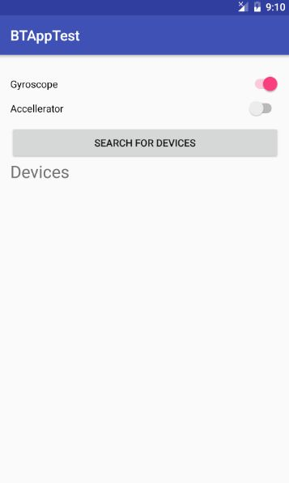
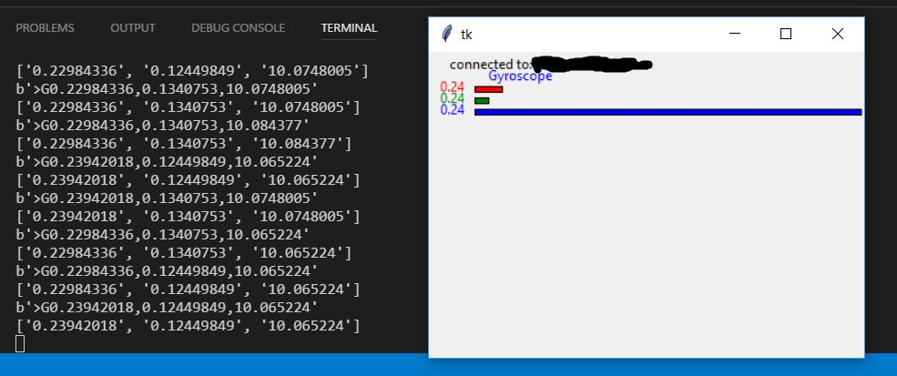

# Android bluetooth client

[android-bt-client.apk](https://github.com/dderevjanik/android-bt-client/releases)

## Android app (BT Client)

Tested on Android 4.x and Android 6.x

1. Click on 'Search for devices' button to start discovery nearby devices
2. Click on device you want to connect (make sure the device you're connecting to, is running bt-server)
3. To switch which sensor data you want to send to server, just clik on one of two Switch-s

## Bluetooth server (Python)

Tested on Python 3.6

1. In order to run `server.py` script you have install [pyBluez](https://github.com/karulis/pybluez) python module
2. Open terminal `python servery.py`
3. Wait for client connection
